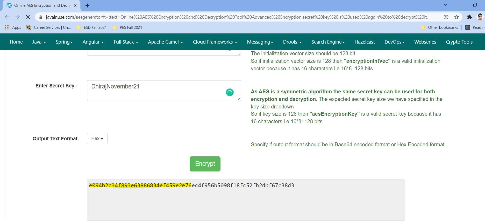
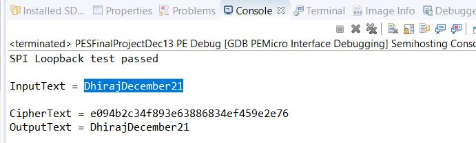
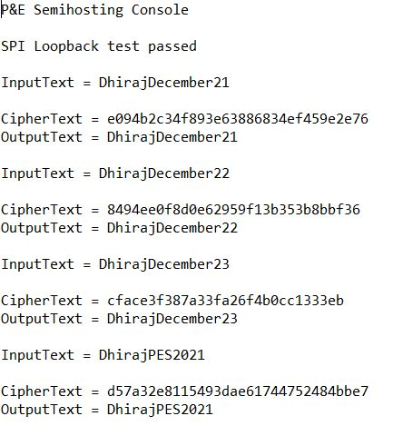
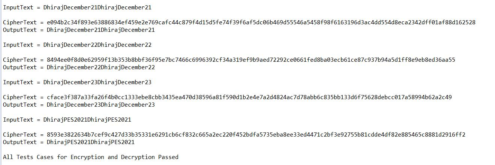

# PES-Final Project

Code for Final Project for PES, ECEN-5813, Fall 2021

This repository is owned by Dhiraj Bennadi (dhiraj.bennadi@colorado.edu).

This repository contains the code for AES encryption and decryption and transmitting the encrypted text over SPI for Decryption

# Credit
Howdy Pierce (hopi7265@colorado.edu), Nimish Bhide (nibh7963@colorado.edu) and Mukta Darekar (muda7613@colorado.edu) for assisting in the technical challenges in the code.

Nimish Bhide (nibh7963@colorado.edu) and Mukta Darekar (muda7613@colorado.edu) for assisting in the technical challenges in the code.

The AES encryption and decryption algorithm is sourced from the below mentioned repository
Code Link:https://github.com/kokke/tiny-AES-c

The code is not used for any commercial purpose.

## Test Results
## Encryption Result using online Tool
;

## Encryption Result on KL25Z
;

## Test Case for Encryption and Decryption executed on KL25Z
;

## Test Case for Encryption and Decryption executed on KL25Z
;
